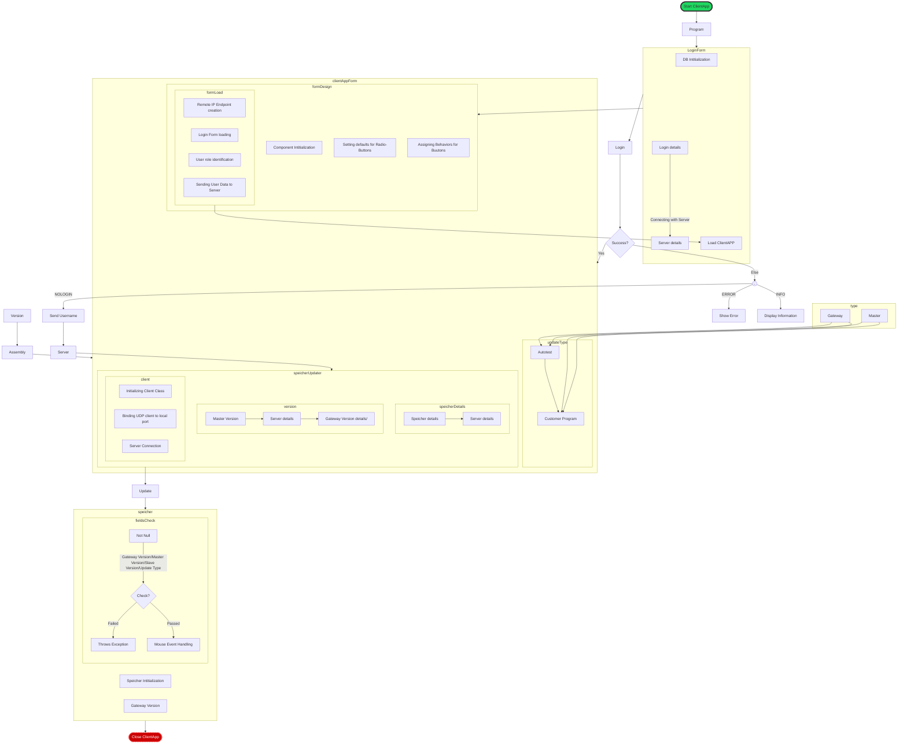

## Flow Chart
---
title: Client App
---

```mermaid
flowchart TD

    subgraph LoginForm
        id0[DB Intitialization];
        id1[Login details] -- Connecting with Server --> id2[Server details];
        id33[Load ClientAPP]
    end
    
    subgraph speicherDetails
        direction LR
        id3[Speicher details] --> id4[Server details];
    end
    
    subgraph version
        direction LR
        id5[Master Version] --> id6[Server details] --> id7[Gateway Version details/];
    end
    
    subgraph updateType
        direction LR
        id8[Autotest] --> id9[Customer Program];
    end
    
    subgraph type
        id10[Gateway] --> id9[Customer Program];
        id10[Gateway] --> id8[Autotest];
        id11[Master] --> id9[Customer Program];
        id11[Master] --> id8[Autotest];
    end
    
    subgraph client
        id15[Initializing Client Class];
        id16[Binding UDP client to local port];
        id17[Server Connection];
    end
    
    subgraph formLoad
        id18[Remote IP Endpoint creation];
        id19[Login Form loading];
        id20[User role identification];
        id21[Sending User Data to Server];
    end
    
    subgraph formDesign
        id12[Component Intitialization];
        id13[Setting defaults for Radio-Buttons];
        id14[Assigning Behaviors for Buutons];
        formLoad
    end
    subgraph speicherUpdater
        version;
        speicherDetails;
        client;
    end
    subgraph clientAppForm
        direction TB
        updateType;
        formDesign;
        speicherUpdater;
    end
    subgraph fieldsCheck
        direction TB
        id12253[Not Null] --> |Gateway Version/Master Version/Slave Version/Update Type|id22553{Check?};
        id22553{Check?} --> |Failed| id12256523[Throws Exception]
        id22553{Check?} --> |Passed| id122652656[Mouse Event Handling]
    end
    
    subgraph speicher
        id1223[Speicher Intitialization];
        fieldsCheck
        id22222[Gateway Version];
    end
    
    
    id100([Start ClientApp]) --> Program;
    Program --> LoginForm;
    LoginForm --> formDesign;
    LoginForm --> Login;
    formLoad --> id33[Load ClientAPP];
    Assembly --> clientAppForm;
    Version --> Assembly;
    Login --> id223((Login Message))
    id223{Success?} --> |Yes| clientAppForm;
    id223{Success?} --> |Else| id224((.))
    id224((.)) --> |NOLOGIN| id225[Send Username] --> id226[Server];
    id224((.)) --> |ERROR| id227[Show Error];
    id224((.)) --> |INFO| id228[Display Information];
    id226[Server] --> speicherUpdater;
    speicherUpdater --> Update;
    Update --> speicher
    speicher --> id200([Close ClientApp]) 
    
    style id100 fill:#1ed760,stroke:#333,stroke-width:4px
    style id200 fill:#cc0000,stroke:#f66,stroke-width:2px,color:#fff,stroke-dasharray: 5 5
    
```
---
title: Server
---

```mermaid
flowchart TD

    subgraph UpdateManager
    id50[Checks Speicher Updates];
    end

    subgraph Spreicher
    id17[Data];
    id49[Speicher Intitialization];
    end

    subgraph Update
    id12[Master];
    id13[Gateway];
    end
    subgraph UpdateTriggers
    id9[Autotest Update Triggers] --> id14[Bootloader];
    id9[Autotest Update Triggers]--> id15[Reparatur];
    end
    
    subgraph Database
    id20[Connection];
    id21[UPDATE];
    id27[FETCH];
    id32[User];
    end
    
    subgraph EventTriggers
    id18[Update];
    id19[Speicher information];
    end

    subgraph UpdateManager
    id4[Setting up TriggerData];
    id7[Initialize Spreicher];
    id8[Count Removed Spreicher];
    id16[Message Handler];
    id11[Update Triggers];
    EventTriggers;
    end
    
    subgraph RequestHandler
    id5[Initialize the timer];
    id6[Starting the timer];
    id3[Initialize Update Manager];
    id44[Handle Request];
    id45[Set Request Type];
    id51[Starts Update Process];
    end
        
    subgraph ClientListener
    
    end
    subgraph Listener
    ClientListener;
    SpreicherListener;
    end
    
    subgraph ClientApp
    id23[Login] --> id47[Received message];
    id47[Received Data];
    id48[Received Message];
    end
    
    subgraph EndPoint
    id28[Client Remote EndPoint];
    end
    
    subgraph Server
    id1[Initialize Production Server];
    RequestHandler;
    Listener;
    id52[Sends back the Client Response];
    end
    
    subgraph Exception
    id22[Error];
    end
    
    
    subgraph DefaultExtract
    id38[Master];
    id39[Gateway];
    id40[UpdateType];
    id46[Replace DEF to value from DB];
    end
    
    
    id100([Start ProductionServer]) --> Program;
    Program --> Server;
    Spreicher -- Message Subscription  --> id16[Message handler];
    id11[Update Triggers] -- Every n Seconds --> UpdateTriggers;
    id14[Bootloader] --> id224{OR?};
    id15[Reparatur] --> id224{OR?};
    id224{OR?} --> |Master| id12[Master];
    id224{OR?} --> |Gateway| id13[Gateway];
    RequestHandler --> UpdateManager;
    id17[Data] -- Async --> ClientListener;
    id17[Data] -- Async --> SpreicherListener;
    id18[Update All] ----> id24[Clients];
    Server -- Initialize --> id20[Connection];
    id19[Speicher information] ----> id21[Update];
    id20[Connection] -- Establish -->id225{Success?};
    id225{Success?} --> |Start| Server;
    id225{Success?} --> |No| Exception;
    Server --> id23[Login];
    id47[Received Data] -- Async Data --> EndPoint;
    EndPoint --> id48[Received Message] --> id226{Operation};
    id226{Operation}-- Login --> id227{Login Verify};
    id226{Operation}-- logout -->  id228{Logout Verify};    
    id226{Operation}-->  id31[Table Updates];
    id31[Table Updates] --> EndPoint;
    id226{Operation}-->  id33[ABBRECHEN];
    id226{Operation}--Else-->  id227{Login Verify};
    id27[FETCH] --> id227{Login Verify};
    id227{Login Verify?} --> |Success| id229((.)) -- ADD --> id32[User];
    id229((.)) --> ClientListener
    id27[FETCH] --> id228{Logout Verify};
    id228{Logout Verify} -- REMOVE --> id32[User];
    id229((.)) --> DefaultExtract
    id38[Master] <--> id46[Replace DEF to value from DB];
    id39[Gateway] <--> id46[Replace DEF to value from DB];
    id38[Master] --> id48[Received Message];
    id39[Gateway] --> id48[Received Message];
    id48[Received Message] --> id44[Handle Request] --> id45[Set Request Type];
    id44[Handle Request] --> Spreicher;
    id49[Speicher Intitialization] --> UpdateManager;
    id44[Handle Request] --> id51[Starts Update Process];
    Server --> ClientApp
    Server --> id200([Close ClientApp]) 
    
    style id100 fill:#1ed760,stroke:#333,stroke-width:4px
    style id200 fill:#cc0000,stroke:#f66,stroke-width:2px,color:#fff,stroke-dasharray: 5 5
```

