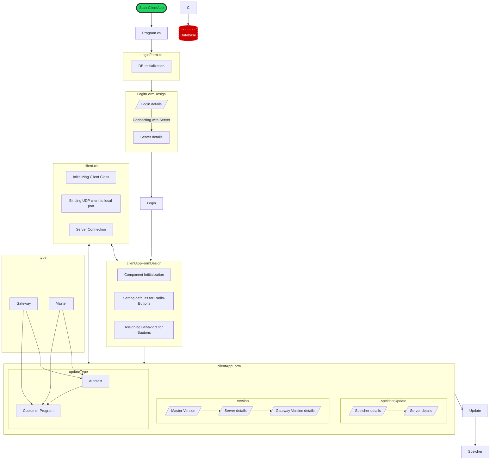

## Flow Chart
---
title: Client App
---

```mermaid
flowchart TD

    subgraph LoginForm.cs
        id0[DB Intitialization];
    end
    
    subgraph LoginFormDesign
        direction TB
        id1[/Login details/] -- Connecting with Server --> id2[Server details];
    end
    
    subgraph speicherUpdate
        direction LR
        id3[/Speicher details/] --> id4[/Server details/];
    end
    
    subgraph version
        direction LR
        id5[/Master Version/] --> id6[/Server details/] --> id7[/Gateway Version details/];
    end
    
    subgraph updateType
        direction LR
        id8[Autotest] --> id9[Customer Program];
    end
    
    subgraph type
        id10[Gateway] --> id9[Customer Program];
        id10[Gateway] --> id8[Autotest];
        id11[Master] --> id9[Customer Program];
        id11[Master] --> id8[Autotest];
    end
    
    subgraph clientAppForm
        direction TB
        updateType;
        version;
        speicherUpdate;
        
    end
    
    subgraph clientAppFormDesign
        id12[Component Intitialization];
        id13[Setting defaults for Radio-Buttons];
        id14[Assigning Behaviors for Buutons];
    end
    
    subgraph client.cs
        id15[Initializing Client Class];
        id16[Binding UDP client to local port];
        id17[Server Connection];
    end
    
    id100([Start ClientApp]) --> Program.cs;
    Program.cs --> LoginForm.cs;
    LoginForm.cs --> LoginFormDesign;
    LoginFormDesign --> Login;
    Login --> clientAppFormDesign;
    client.cs <--> clientAppForm;
    client.cs <--> clientAppFormDesign;
    clientAppFormDesign --> clientAppForm;
    
    
    
    
    
    
    clientAppForm --> Update;
    Update --> Speicher;
    C --> id200[(Database)]
 
    
    style id100 fill:#1ed760,stroke:#333,stroke-width:4px
    style id200 fill:#cc0000,stroke:#f66,stroke-width:2px,color:#fff,stroke-dasharray: 5 5
    
```
    
